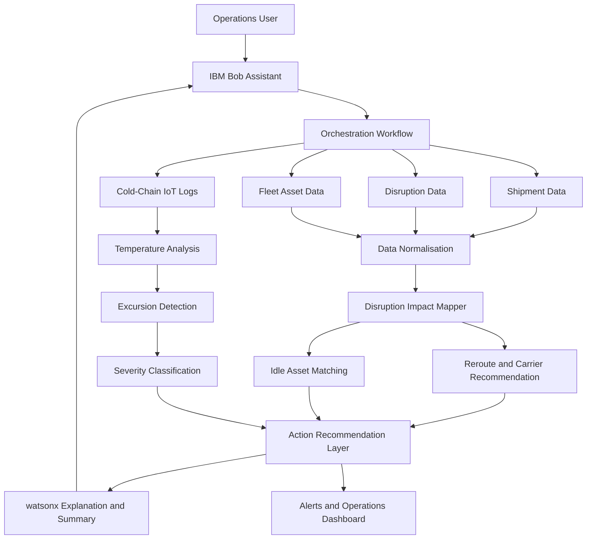

# Architecture

## System Architecture

[Describe the overall architecture of your system. Replace the Mermaid diagram below with your actual architecture.]

## Components

| Component | Technology | Responsibility |
|---|---|---|
| Frontend | HTML / CSS / JavaScript | Operations dashboard, shipment monitoring and user interaction |
| Backend API | FastAPI | Business logic, API endpoints and workflow orchestration |
| Data Processing | Python / Pandas | Data cleaning, normalization and logistics data analysis |
| AI / ML | IBM watsonx | Risk analysis, severity classification and recommendation explanations |
| Orchestration | IBM Bob | Coordinates the supply-chain analysis workflow and user assistance |
| Database | SQLite / PostgreSQL | Storing shipments, fleet data, alerts, analysis results and recommendations |
| Data Sources | CSV / REST APIs | Providing logistics, disruption, fleet and cold-chain IoT data |
| Monitoring | Python / Pandas | Detecting temperature excursions and identifying affected shipments |
| Documentation | Mermaid | System architecture and data-flow documentation |

## Data Flow

1. Shipment, disruption, fleet and cold-chain IoT data are collected from CSV files and REST APIs.
2. Python/Pandas cleans, validates and normalizes the incoming data.
3. The Disruption Impact Mapper identifies shipments affected by active disruptions.
4. The system evaluates alternative routes and carriers and generates rerouting recommendations.
5. Fleet data is analyzed to identify idle assets suitable for redeployment.
6. Cold-chain IoT logs are analyzed to detect temperature excursions and abnormal readings.
7. Detected temperature excursions are classified according to their severity and cargo risk.
8. The Action Recommendation Layer combines disruption, routing, carrier, fleet and cold-chain results.
9. IBM watsonx generates explanations and summaries of the recommendations where configured.
10. Results and alerts are stored in SQLite/PostgreSQL and exposed through FastAPI REST APIs.
11. The operations dashboard displays affected shipments, recommended actions, idle assets and cold-chain alerts.
12. IBM Bob assists the operations user in understanding and acting on the recommendations.
## Security Considerations

[Note any security decisions relevant to the architecture — even if basic.]

- [e.g., API keys stored in environment variables, never committed to git]
- [e.g., All API routes require a Bearer token]
- [e.g., Database credentials rotated via IBM Secrets Manager]

## Scalability Notes

[Optional: how would this scale beyond the hackathon prototype?]

[e.g., "The FastAPI backend is stateless and could be horizontally scaled behind a load balancer. The watsonx.ai calls are the bottleneck and would benefit from request batching."]
